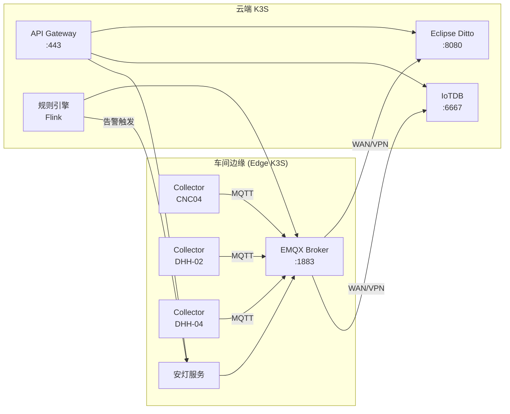

# 部署拓扑（Deployment Topology）

> 基于 K3S 的边缘+云端混合部署架构，适用于工厂车间。

---

## 1. 组件总览

```
┌─────────────────────────────────────────────────────────────────┐
│                     云端（K3S Cluster）                          │
│                                                                 │
│  ┌──────────┐  ┌──────────┐  ┌──────────┐  ┌──────────┐       │
│  │  API GW  │  │  Ditto   │  │  IoTDB   │  │ 规则引擎 │       │
│  │ (BFF)    │  │ Thing    │  │ 时序库   │  │（可选）  │       │
│  └────┬─────┘  └────┬─────┘  └────┬─────┘  └────┬─────┘       │
│       │             │             │              │              │
│       └─────────────┴──────┬─────┴──────────────┘              │
│                            │                                   │
│                    ┌───────┴───────┐                          │
│                    │  Message Bus  │                          │
│                    │  (MQTT/NSQ)   │                          │
│                    └───────┬───────┘                          │
└────────────────────────────┼───────────────────────────────────┘
                             │ (WAN / VPN)
┌────────────────────────────┼───────────────────────────────────┐
│                     车间边缘（K3S Edge）                        │
│                            │                                   │
│  ┌─────────────────────────┴──────────────────────────────┐   │
│  │              安灯服务（Andon Service）                   │   │
│  └─────────────────────────┬──────────────────────────────┘   │
│                            │                                   │
│         ┌──────────────────┼──────────────────┐                │
│         │                  │                  │                │
│  ┌──────┴──────┐   ┌──────┴──────┐   ┌──────┴──────┐        │
│  │ Collector   │   │ Collector   │   │ Collector   │  ...  │
│  │ (CNC04)     │   │ (DHH-02)    │   │ (DHH-04)    │        │
│  └──────┬──────┘   └──────┬──────┘   └──────┬──────┘        │
│         │                  │                  │                 │
│         └──────────────────┼──────────────────┘                 │
│                            │                                   │
│                     ┌──────┴──────┐                          │
│                     │  MQTT Broker │                          │
│                     │ (EMQX)       │                          │
│                     └──────────────┘                          │
└─────────────────────────────────────────────────────────────────┘
```

---

## 2. K3S 组件详情

### 2.1 API 网关 / BFF

| 属性 | 值 |
|------|-----|
| 镜像 | `nginx:alpine` 或 `envoyproxy/envoy` |
| 作用 | REST API 反向代理、WebSocket/SSE 协议升级、SSL 终结 |
| 端口 | 443 (HTTPS), 80 (HTTP 重定向) |
| 认证 | JWT Bearer Token 校验 |
| 限流 | 1000 req/s 每租户 |
| 资源限制 | CPU: 1 core, Memory: 1 Gi |

### 2.2 Eclipse Ditto（数字孪生）

| 属性 | 值 |
|------|-----|
| 官方镜像 | `eclipse/ditto:3.0.0` |
| 作用 | 设备数字孪生（Thing Model）、设备配置管理、筱视状态 |
| 端口 | 8080 (HTTP), 9443 (HTTPS) |
| 存储 | MongoDB（Ditto 自身状态），生产环境建议 3 节点 replica set |
| MQTT 桥接 | Ditto 内置 MQTT 网关，桥接到集群内部 Message Bus |
| Namespace | `org.gencore`（可配置） |
| 资源限制 | CPU: 2 cores, Memory: 4 Gi |

**Ditto Thing 模型**对应本系统的设备模型，参见 `data-models.md`。

### 2.3 IoTDB（时序数据库）

| 属性 | 值 |
|------|-----|
| 官方镜像 | `apache/iotdb:1.3.0` |
| 作用 | 高性能时序数据存储（设备采样数据、历史查询） |
| 端口 | 6667 (Thrift), 8181 (REST) |
| 存储 | 本地 SSD 或 NFS 持久卷（100 Gi per StatefulSet for 30-day hot data） |
| 分片 | 按租户分片，支持水平扩展 |
| 资源限制 | CPU: 4 cores, Memory: 16 Gi |

**时序数据模型**参见 `data-models.md`。

#### IoTDB 存储策略

- **热数据（Hot Data）**：本地 SSD/NFS，保留 30 天，100 Gi per StatefulSet
- **温数据（Warm Data）**：冷热分层，可配置 time-partition
- **备份策略**：定期 compaction 合并小文件，S3 long-term archive
  ```bash
  # 示例：S3 compaction 脚本（crontab）
  0 2 * * * /opt/iotdb/sbin/compact.sh && aws s3 sync /data/iotdb s3://bucket/iotdb/
  ```

### 2.4 EMQX（MQTT Broker）

| 属性 | 值 |
|------|-----|
| 官方镜像 | `emqx/emqx:5.8`（开源版） |
| 作用 | MQTT Broker，支持大规模设备连接、消息路由、Webhook |
| 端口 | 1883 (MQTT), 8083 (MQTT/WS), 8084 (MQTT/TLS), 18083 (Dashboard) |
| 资源限制 | CPU: 2 cores, Memory: 2 Gi |
| 集群 | K8S Operator 支持，生产建议 3 节点 |
| 认证 | JWT / X.509 证书认证 |
| 规则引擎 | 内置规则引擎，可直接桥接到 Kafka 或数据库（<10k devices/sec） |

#### EMQX 资源估算（每 10k 设备）

| 指标 | 值 |
|------|-----|
| 连接数 | 10,000 |
| 消息吞吐 | ~50k msg/sec（假设 5 变量/设备，采集周期 1s） |
| CPU | 2 cores per 10k devices |
| Memory | 2 Gi per 10k devices |
| 磁盘 IO | SSD 建议（消息持久化场景） |

### 2.5 Kafka（高吞吐场景可选）

**何时需要 Kafka**：设备数量 >10,000 或消息吞吐 >50,000 msg/sec 时，EMQX 可通过规则引擎桥接到 Kafka 进行缓冲。

| 属性 | 值 |
|------|-----|
| 推荐实现 | Apache Kafka 3.6+ / MSK（AWS）/ Confluent Cloud |
| 作用 | 高吞吐消息缓冲、事件流处理、日志持久化 |
| 资源估算 | CPU: 4 cores, Memory: 8 Gi per broker（3 broker 最小集群） |
| 保留策略 | 7 天保留，50 Gi per broker |

**直接 MQTT → RuleEngine 模式（<10k 设备）**：
- EMQX 内置规则引擎直接处理消息路由
- 无需额外 Kafka 组件
- 延迟更低，运维更简单

### 2.6 规则引擎（可选）

| 属性 | 值 |
|------|-----|
| 推荐实现 | Apache Flink / Kafka Streams |
| 作用 | 实时告警规则计算、事件流处理 |
| 触发 | 订阅 `gen/{id}/alert` 主题 |
| 资源限制 | CPU: 2 cores, Memory: 2 Gi |
| 场景 | >10k 设备/秒 或需要复杂事件处理（CEP）时部署 |

### 2.7 安灯服务（Andon Service）

| 属性 | 值 |
|------|-----|
| 镜像 | 自定义 `genplatform/andon-service:latest` |
| 作用 | 产线安灯状态管理、告警灯柱控制（通过 `gen/{id}/status` 驱动） |
| 端口 | 8081 |
| 依赖 | MQTT Broker, Ditto |
| 推送 | SSE/WebSocket 实时推送安灯状态 |
| 资源限制 | CPU: 1 core, Memory: 512 Mi |

---

## 3. 数据流图（Mermaid）



---

## 4. 采集器独立部署位置

采集器以**独立进程**部署，不强制要求容器化（支持直接二进制运行）：

| 节点 | 采集器 | 协议 | 部署位置 |
|------|--------|------|----------|
| 192.168.3.14 | Fanuc CNC 04 | FOCAS | 车间工控机 |
| 192.168.3.22 | DHH-02 (HttpMem) | HTTP | 车间工控机 |
| 192.168.3.40 | 三菱 EDM DHH-04 | 自定义 | 车间工控机 |
| 127.0.0.1 | Go 主网关 | HTTP | 边缘网关节点 |

采集器通过 MQTT（QoS 0/1）与云端/边缘 MQTT Broker 通信，不直接暴露 HTTP 端口。

### 4.1 RemoteComm.dll 32-bit 驱动问题

**问题描述**：`RemoteComm.dll` 是 32-bit 驱动组件，部分工控机环境无法加载。

**长期解决方案**：将 32-bit 驱动隔离到独立的 **DriverHost 进程**（x86），通过 **gRPC** 与主采集器进程通信。

```
┌─────────────────────────────────────────────────────────┐
│  Collector.exe (64-bit .NET)                            │
│     │                                                   │
│     │ gRPC (localhost:50051)                           │
│     ▼                                                   │
│  ┌─────────────────────────────────────────────────┐   │
│  │  DriverHost.exe (32-bit x86)                    │   │
│  │     └── RemoteComm.dll (32-bit native driver)   │   │
│  └─────────────────────────────────────────────────┘   │
└─────────────────────────────────────────────────────────┘
```

**优点**：
- 主采集器进程保持 64-bit，享受更大内存地址空间
- 32-bit 驱动隔离，不影响整体稳定性
- DriverHost 崩溃不会导致主进程崩溃，可自动重启

**实现建议**：
1. 创建 `DriverHost` 项目（32-bit x86）
2. 定义 gRPC 契约（`.proto`）
3. DriverHost 加载 `RemoteComm.dll`，暴露读写接口
4. Collector 通过 gRPC 调用 DriverHost

---

## 5. 租户隔离策略

| 层级 | 隔离方式 |
|------|----------|
| MQTT | 每个租户使用独立 topic 命名空间 `gen/{tenantId}/{collectorId}/...` |
| IoTDB | 每个租户独立 path prefix `/root/tenant_{id}/` |
| Ditto | 每个租户独立 Namespace 或 Thing ID 前缀 |
| API | JWT claim `tenant_id` 强制校验 |
| K3S | NetworkPolicy 限制跨租户 Pod 通信 |

---

## 6. 端口汇总

| 组件 | 端口 | 协议 |
|------|------|------|
| API Gateway | 443 | HTTPS |
| Eclipse Ditto | 8080 | HTTP |
| IoTDB | 6667 | Thrift |
| IoTDB REST | 8181 | HTTP |
| EMQX MQTT | 1883 | MQTT |
| EMQX MQTT/WS | 8083 | MQTT over WebSocket |
| EMQX Dashboard | 18083 | HTTPS |
| 安灯服务 | 8081 | HTTP |
| 规则引擎 | 8082 | HTTP |
| Kafka (可选) | 9092 | Kafka |

---

## 7. 组件资源限制汇总

| 组件 | CPU | Memory | Storage |
|------|-----|--------|---------|
| API Gateway (BFF) | 1 core | 1 Gi | - |
| Eclipse Ditto | 2 cores | 4 Gi | MongoDB 50 Gi |
| IoTDB | 4 cores | 16 Gi | 100 Gi (hot) |
| EMQX | 2 cores | 2 Gi | SSD 50 Gi |
| Kafka (可选) | 4 cores | 8 Gi | 50 Gi per broker |
| 规则引擎 | 2 cores | 2 Gi | - |
| 安灯服务 | 1 core | 512 Mi | - |
| OpenTelemetry Collector | 0.5 core | 256 Mi | - |

---

## 8. 安全配置

### 8.1 传输层安全

| 链路 | 加密方式 |
|------|----------|
| MQTT Broker ↔ 采集器 | TLS 1.3（EMQX 支持） |
| K8S Ingress | TLS 1.3（HTTPS） |
| 服务间通信（mTLS） | 服务网格（Istio/Linkerd）或手动证书轮换 |
| 云端 ↔ 边缘 VPN | WireGuard 或 IPSec |

### 8.2 密钥管理

| 方案 | 适用场景 |
|------|----------|
| K8s Secrets | 基础密钥管理（证书、密码） |
| External Vault (HashiCorp) | 企业级密钥管理、审计日志、动态凭证 |
| AWS Secrets Manager / Azure Key Vault | 云环境 |

**建议**：使用 External Vault 或云服务商密钥管理，便于密钥轮换和审计。

### 8.3 网络策略

```yaml
# K8s NetworkPolicy 示例（限制 Pod 间通信）
apiVersion: networking.k8s.io/v1
kind: NetworkPolicy
metadata:
  name: ditto-isolation
spec:
  podSelector:
    matchLabels:
      app: ditto
  policyTypes:
    - Ingress
  ingress:
    - from:
        - podSelector:
            matchLabels:
              app: api-gateway
```

---

## 9. 可观测性

### 9.1 OpenTelemetry 架构

每个 Pod 部署 OpenTelemetry Collector Sidecar：

```
┌────────────────────────────────────────────────────────┐
│                    Pod                                 │
│  ┌──────────┐    ┌────────────────┐    ┌───────────┐  │
│  │  App     │───▶│  OTel Sidecar  │───▶│  Backend  │  │
│  │  (Collector/Service) │ Collector     │  (Grafana,  │  │
│  └──────────┘    └────────────────┘    │   Jaeger)   │  │
│                                         └───────────┘  │
└────────────────────────────────────────────────────────┘
```

### 9.2 指标监控（Prometheus）

| 组件 | 关键指标 |
|------|----------|
| EMQX | `mqtt_client_connected`, `mqtt_messages_received`, `mqtt_messages_sent` |
| IoTDB | `iotdb_storage_size`, `iotdb_query_latency` |
| Ditto | `ditto_things_active`, `ditto_messages_received` |
| K8s Pod | `pod_cpu_usage_seconds_total`, `pod_memory_working_set_bytes` |

### 9.3 日志收集（Loki）

- 使用 Promtail DaemonSet 收集节点日志
- 日志存储在 Loki，Grafana 可视化查询
- 结构化日志（JSON）便于检索

### 9.4 告警规则

| 告警名称 | 条件 | 严重度 |
|----------|------|--------|
| EMQXQueueBacklog | `queue_size > 10000` 持续 5min | warning |
| DeviceOffline | 设备离线 > 5min | warning |
| HighCPU | `cpu_usage > 80%` 持续 10min | warning |
| HighMemory | `memory_usage > 85%` 持续 10min | warning |
| KafkaLag | `consumer_lag > 10000` 持续 5min | critical |

### 9.5 Grafana Dashboard

建议导入以下 Dashboard：
- **K8s Cluster Overview**（官方）
- **EMQX Dashboard**（官方）
- **IoTDB Monitoring**（官方）
- **自定义安灯系统 Dashboard**（产线状态、设备告警）

---

## 10. 生产环境 K3S 资源配置建议

### 控制平面（Master Node）

| 组件 | CPU | Memory | Disk |
|------|-----|--------|------|
| etcd | 2 cores | 8 Gi | 50 Gi SSD |
| kube-apiserver | 2 cores | 4 Gi | - |
| kube-scheduler | 1 core | 2 Gi | - |
| kube-controller-manager | 1 core | 2 Gi | - |

### 工作节点（Worker Node）

| 节点类型 | CPU | Memory | Disk |
|----------|-----|--------|------|
| 通用 Worker | 4 cores | 8 Gi | 100 Gi SSD |
| IoTDB 专用 | 8 cores | 32 Gi | 500 Gi NVMe |
| EMQX 专用 | 4 cores | 8 Gi | 100 Gi SSD |

---

## 11. 备份与灾难恢复

| 组件 | 备份策略 |
|------|----------|
| MongoDB (Ditto) | 每日全量 + Oplog 增量，S3 归档 |
| IoTDB | 定期 compaction + S3 归档 |
| K8s ConfigMaps/Secrets | Velero 备份 |
| EMQX | 配置持久化到 PVC + S3 备份 |

